# HW00

Homework 00 is documented with screenshots that show the required tools, platforms, and accounts were set up successfully.

## Screenshot Gallery

<table>
  <tr>
    <td align="center">
      <strong>AWS S3</strong> 
      
    </td>
    <td align="center">
      <strong>ElasticSearch</strong> 
      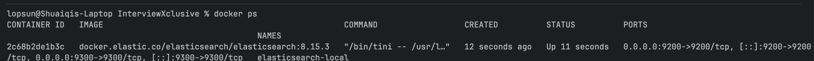
    </td>
  </tr>
  <tr>
    <td align="center">
      <strong>Gradle</strong> 
      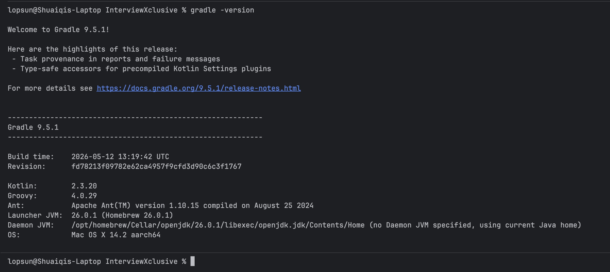
    </td>
    <td align="center">
      <strong>LinkedIn</strong> 
      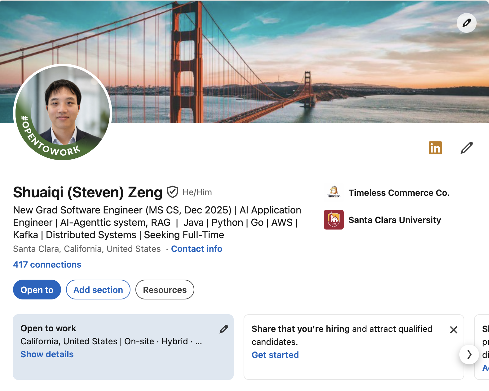
    </td>
  </tr>
  <tr>
    <td align="center">
      <strong>Maven</strong> 
      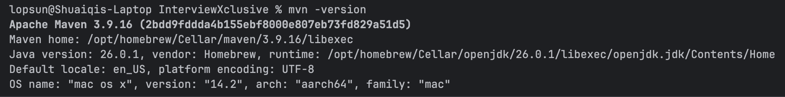
    </td>
    <td align="center">
      <strong>OBS</strong> 
      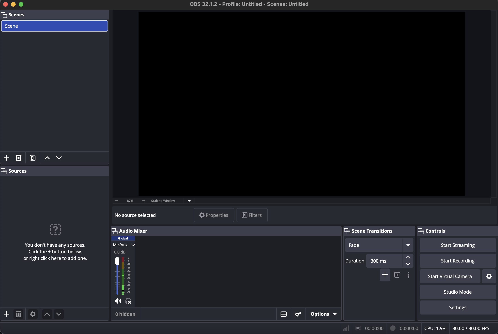
    </td>
  </tr>
  <tr>
    <td align="center">
      <strong>Cassandra</strong> 
      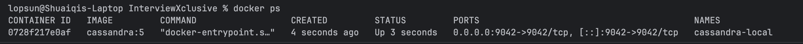
    </td>
    <td align="center">
      <strong>Codex CLI</strong> 
      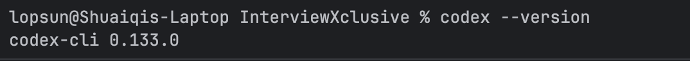
    </td>
  </tr>
  <tr>
    <td align="center">
      <strong>Docker</strong> 
      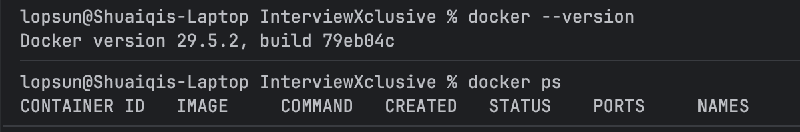
    </td>
    <td align="center">
      <strong>IntelliJ</strong> 
      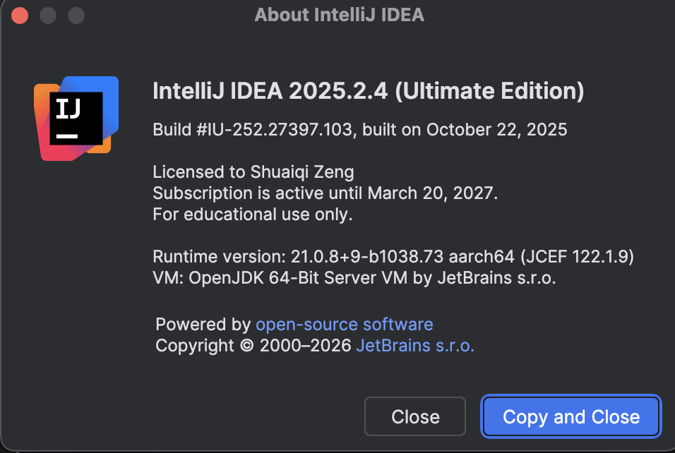
    </td>
  </tr>
  <tr>
    <td align="center">
      <strong>Java 21</strong> 
      
    </td>
    <td align="center">
      <strong>MongoDB</strong> 
      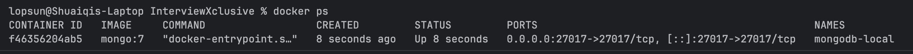
    </td>
  </tr>
  <tr>
    <td align="center">
      <strong>PostgreSQL</strong> 
      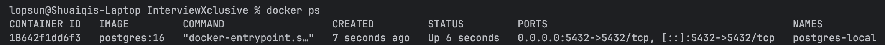
    </td>
    <td align="center">
      <strong>Redis</strong> 
      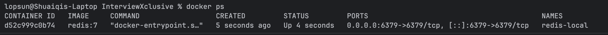
    </td>
  </tr>
</table>

## Summary

This homework entry serves as a visual checklist showing that the required setup items were completed successfully.
