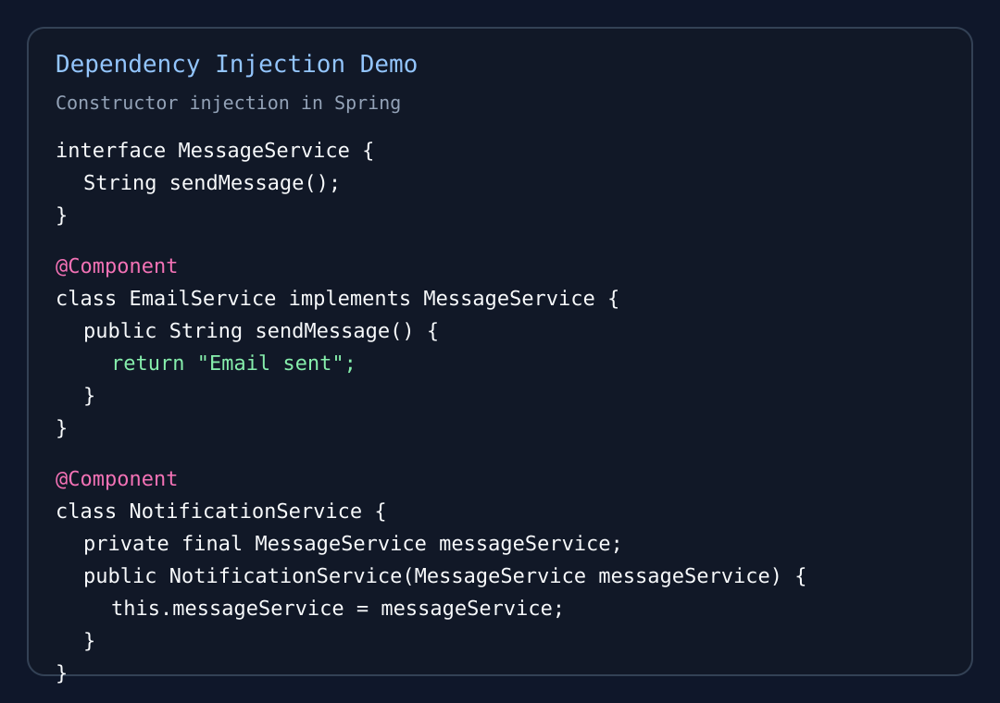

# HW09

This homework was drafted in Notion and published here as a GitHub-friendly Markdown page.

## 1. What is Spring IoC?

Spring IoC means Spring uses Inversion of Control to manage objects for us.

In a traditional Java program, we often create objects manually with `new`. In Spring, the framework creates, stores, and connects objects for us.

So in simple words, IoC means control of object creation moves from our application code to the Spring framework.

## 2. What is IoC Container?

The IoC Container is the part of Spring that manages beans.

Its job is to:

- create objects
- store objects
- inject dependencies
- manage bean lifecycle
- manage bean scope

Common container interfaces:

- `BeanFactory`
- `ApplicationContext`

In real Spring Boot projects, `ApplicationContext` is the container we use most often.

## 3. What is the advantage of IoC?

Main advantages:

- **Loose coupling**: classes depend less on concrete implementations
- **Easier testing**: dependencies can be replaced with mock or fake implementations
- **Cleaner code**: less manual object creation logic
- **Better maintainability**: changing one implementation usually does not require changing many classes
- **Centralized configuration**: object creation and wiring are managed in one place by Spring

My own summary: IoC lets developers focus more on business logic and less on object management.

## 4. What is Dependency Injection (DI)?

Dependency Injection means Spring provides the dependency a class needs instead of the class creating it by itself.

For example, if `NotificationService` needs `MessageService`, we do not write:

```java
MessageService service = new EmailService();
```

inside the class. Instead, Spring injects the needed object.

DI is one of the most practical ways Spring implements IoC.

## 5. Demo code to show Dependency Injection

### Demo code

```java
package com.example.didemo;

import org.springframework.stereotype.Component;

interface MessageService {
    String sendMessage();
}

@Component
class EmailService implements MessageService {
    @Override
    public String sendMessage() {
        return "Email sent";
    }
}

@Component
class NotificationService {
    private final MessageService messageService;

    public NotificationService(MessageService messageService) {
        this.messageService = messageService;
    }

    public String notifyUser() {
        return messageService.sendMessage();
    }
}
```

### Why this is DI

- `NotificationService` depends on `MessageService`
- `NotificationService` does not create `EmailService` with `new`
- Spring finds `EmailService` as a bean
- Spring injects it into `NotificationService` through the constructor

So this is constructor injection.

### Screenshot



## 6. What are different types of Dependency Injection?

Common types:

- Constructor Injection
- Setter Injection
- Field Injection

## 7. Pros and cons of each type of Dependency Injection

### Constructor Injection

**Pros**

- makes required dependencies explicit
- easier to test
- supports immutable fields with `final`
- usually the cleanest design

**Cons**

- constructor can become long if a class has too many dependencies
- may show that the class has too many responsibilities

### Setter Injection

**Pros**

- useful for optional dependencies
- more flexible when a dependency does not have to exist at object creation time

**Cons**

- object may be incomplete if setter is never called
- dependencies are less explicit than constructor injection
- harder to make the object immutable

### Field Injection

**Pros**

- shortest code
- quick for very small demos

**Cons**

- harder to test
- hides dependencies
- not friendly for immutability
- generally not recommended in professional code compared with constructor injection

## 8. `@Component` vs `@Bean`

### `@Component`

- used on the class itself
- Spring finds it through component scanning
- good for application classes like service, repository, and controller

### `@Bean`

- used on a method inside a configuration class
- the method returns the object Spring should manage
- useful when we want manual control over object creation
- useful for third-party classes we cannot annotate directly

### My own summary

Use `@Component` when Spring can directly scan the class.  
Use `@Bean` when you need custom creation logic or when the class comes from an external library.

## 9. What is `@Configuration` and `@ComponentScan`?

### `@Configuration`

`@Configuration` tells Spring that a class contains bean definitions.

Example:

```java
@Configuration
public class AppConfig {

    @Bean
    public MessageService messageService() {
        return new EmailService();
    }
}
```

### `@ComponentScan`

`@ComponentScan` tells Spring which packages to scan for classes marked with annotations like:

- `@Component`
- `@Service`
- `@Repository`
- `@Controller`

Without scanning, Spring would not automatically discover those beans.

## 10. `@Controller` vs `@RestController`

### `@Controller`

- mainly used in Spring MVC web applications
- often returns a view name
- usually works with HTML pages or templates

### `@RestController`

- used for REST APIs
- returns data directly, often JSON
- it is basically `@Controller + @ResponseBody`

### My own summary

Use `@Controller` for page-based MVC.  
Use `@RestController` for API responses.

## 11. `@Controller` vs `@Service` vs `@Repository`

### `@Controller`

- handles incoming HTTP requests
- talks to service layer

### `@Service`

- contains business logic
- processes application rules

### `@Repository`

- handles database access
- works with JPA or SQL operations
- also helps Spring translate some persistence exceptions

### My own summary

They are all Spring-managed beans, but each one represents a different layer responsibility.

## 12. Spring bean scope

Common Spring bean scopes:

- singleton
- prototype
- request
- session
- application
- websocket

The most common ones in interviews are singleton, prototype, request, and session.

## 13. Singleton vs Prototype

### Singleton

- one bean instance for the whole Spring container
- default scope in Spring
- shared by all users and all requests inside that application context

### Prototype

- a new bean instance is created every time it is requested
- useful when object state should not be shared

### My own summary

Singleton is shared.  
Prototype is newly created each time.

## 14. Three use cases for each bean scope

### Singleton scope use cases

1. `UserService` or `OrderService` that contains business logic but no request-specific state
2. Utility service such as `EmailFormatterService`
3. Repository or DAO bean used across the whole application

### Prototype scope use cases

1. A report builder object that stores temporary per-task state
2. A file parsing object created fresh for each parsing job
3. A shopping calculation helper object that holds short-lived custom values

### Request scope use cases

1. Store request-specific metadata such as trace information
2. Hold one request's form input processing state
3. Per-request authentication context wrapper

### Session scope use cases

1. Shopping cart for one logged-in user
2. User preference object during one browser session
3. Multi-step wizard form state kept across several requests in the same session

## 15. Session vs Cookie

### Cookie

- stored in the browser on the client side
- usually small pieces of data
- automatically sent back to the server with later requests to the same domain

### Session

- stored on the server side
- used to keep user state between requests
- usually identified by a session ID, which is often stored in a cookie

### Main differences

- Cookie is client-side data
- Session is server-side data
- Cookie usually stores less sensitive data
- Session is safer for storing important user state

### My own summary

A cookie often helps identify the user session.  
The real session data usually lives on the server.

## 16. Final summary

- IoC means Spring controls object creation
- the IoC Container manages beans and their lifecycle
- DI is how Spring injects one object into another
- constructor injection is usually the best choice in professional projects
- `@Component`, `@Service`, `@Repository`, and `@Controller` help Spring discover beans
- `@RestController` is used for APIs
- singleton is the default scope, while prototype, request, and session are used for more specific lifecycle needs
