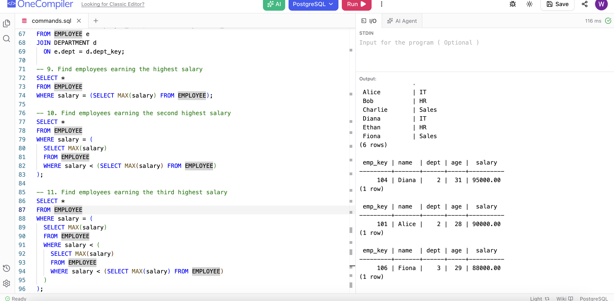

# HW13

This homework covers database fundamentals and SQL query practice.

Source page: [HW 13 on Notion](TO_BE_UPDATED)

## Part 1. Concept notes

### SQL vs NoSQL database

SQL databases are relational databases. They store data in tables with rows and columns, and they usually use a fixed schema. Examples are PostgreSQL, MySQL, Oracle, and SQL Server.

NoSQL databases are non-relational databases. They are more flexible in data model and may store data as documents, key-value pairs, wide columns, or graphs. Examples are MongoDB, Redis, Cassandra, and Neo4j.

My own summary:

- SQL is better when data is structured and relationships and transactions are important
- NoSQL is better when schema flexibility, horizontal scaling, or very large distributed workloads matter more

### What is database normalization

Database normalization is the process of organizing tables to reduce redundancy and improve data consistency.

The main idea is:

- avoid repeating the same data in many places
- separate data into proper tables
- connect those tables with keys

For example, instead of storing department name again and again inside every employee row, I can create a separate `DEPARTMENT` table and reference it from `EMPLOYEE`.

Benefits:

- less duplicated data
- easier updates
- better consistency

### Vertical scaling vs horizontal scaling

Vertical scaling means making one machine stronger, for example by adding more CPU, memory, or storage.

Horizontal scaling means adding more machines and distributing the load across them.

My summary:

- vertical scaling is simpler, but has hardware limits
- horizontal scaling is more flexible and is commonly used in distributed systems

### What is ACID

ACID describes the main transaction properties in relational databases.

- Atomicity: a transaction is all-or-nothing
- Consistency: data remains valid before and after the transaction
- Isolation: concurrent transactions do not break each other
- Durability: once committed, data is not lost even after crash or restart

### What is CAP

CAP theorem says that in a distributed system, we usually need to balance three things:

- Consistency
- Availability
- Partition tolerance

When a network partition happens, a distributed system usually has to choose between stronger consistency and higher availability.

## Part 2. SQL query practice

Practice platform:
[OneCompiler PostgreSQL](https://onecompiler.com/postgresql/)

Note:
The prompt listed `Employee(key, name, dept, age)` and `Department(key, name)`, but later salary-based queries were required, so I added a `salary` column to the `EMPLOYEE` table.

### SQL statements

```sql
-- create Department table
CREATE TABLE DEPARTMENT (
  dept_key INTEGER PRIMARY KEY,
  name TEXT NOT NULL
);

-- create Employee table
CREATE TABLE EMPLOYEE (
  emp_key INTEGER PRIMARY KEY,
  name TEXT NOT NULL,
  dept INTEGER,
  age INTEGER,
  salary NUMERIC(10,2),
  FOREIGN KEY (dept) REFERENCES DEPARTMENT(dept_key)
);

-- dummy data for Department
INSERT INTO DEPARTMENT (dept_key, name) VALUES
(1, 'HR'),
(2, 'IT'),
(3, 'Sales');

-- dummy data for Employee
INSERT INTO EMPLOYEE (emp_key, name, dept, age, salary) VALUES
(101, 'Alice', 2, 28, 90000),
(102, 'Bob', 1, 35, 75000),
(103, 'Charlie', 3, 26, 82000),
(104, 'Diana', 2, 31, 95000),
(105, 'Ethan', 1, 40, 60000),
(106, 'Fiona', 3, 29, 88000);

-- 1. Get only employee names and ages
SELECT name, age
FROM EMPLOYEE;

-- 2. Find employees older than 30
SELECT *
FROM EMPLOYEE
WHERE age > 30;

-- 3. Find employees whose salary is greater than 80,000
SELECT *
FROM EMPLOYEE
WHERE salary > 80000;

-- 4. List employees ordered by age (ascending)
SELECT *
FROM EMPLOYEE
ORDER BY age ASC;

-- 5. Get the top 3 highest-paid employees
SELECT *
FROM EMPLOYEE
ORDER BY salary DESC
LIMIT 3;

-- 6. Count total number of employees
SELECT COUNT(*) AS total_employees
FROM EMPLOYEE;

-- 7. Find the average salary of all employees
SELECT AVG(salary) AS average_salary
FROM EMPLOYEE;

-- 8. List employee name with department name
SELECT e.name AS employee_name, d.name AS department_name
FROM EMPLOYEE e
JOIN DEPARTMENT d
  ON e.dept = d.dept_key;

-- 9. Find employees earning the highest salary
SELECT *
FROM EMPLOYEE
WHERE salary = (SELECT MAX(salary) FROM EMPLOYEE);

-- 10. Find employees earning the second highest salary
SELECT *
FROM EMPLOYEE
WHERE salary = (
  SELECT MAX(salary)
  FROM EMPLOYEE
  WHERE salary < (SELECT MAX(salary) FROM EMPLOYEE)
);

-- 11. Find employees earning the third highest salary
SELECT *
FROM EMPLOYEE
WHERE salary = (
  SELECT MAX(salary)
  FROM EMPLOYEE
  WHERE salary < (
    SELECT MAX(salary)
    FROM EMPLOYEE
    WHERE salary < (SELECT MAX(salary) FROM EMPLOYEE)
  )
);
```

### Output summary

```text
CREATE TABLE
CREATE TABLE
INSERT 0 3
INSERT 0 6

name, age:
Alice 28
Bob 35
Charlie 26
Diana 31
Ethan 40
Fiona 29

Employees older than 30:
Bob
Diana
Ethan

Employees with salary > 80000:
Alice
Charlie
Diana
Fiona

Top 3 highest-paid:
Diana 95000
Alice 90000
Fiona 88000

Total employees:
6

Average salary:
81666.666666666667

Employee with department:
Alice -> IT
Bob -> HR
Charlie -> Sales
Diana -> IT
Ethan -> HR
Fiona -> Sales

Highest salary:
Diana

Second highest salary:
Alice

Third highest salary:
Fiona
```

### Screenshot submission


