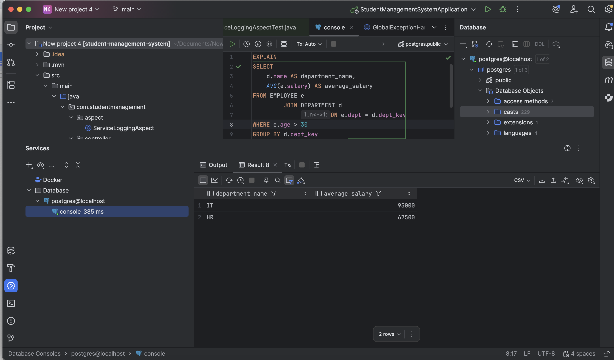
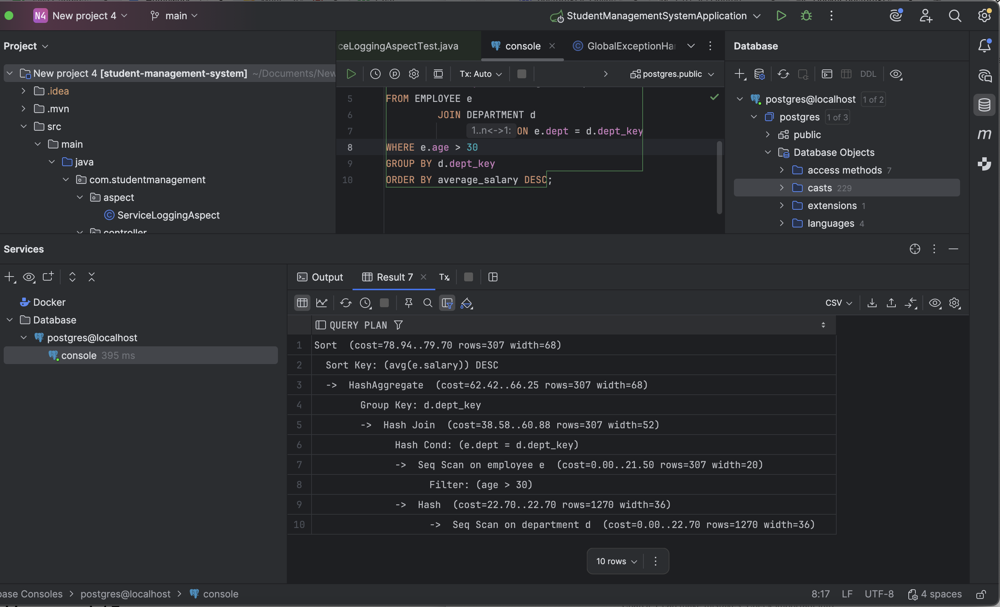

# HW14

This homework covers indexing, query tuning, view-related concepts, distributed transaction patterns, and one SQL aggregation practice with `EXPLAIN`.

Source page: [HW 14 on Notion](TO_BE_UPDATED)

## Part 1. Concept notes

### What is index

An index is a database structure used to speed up data lookup.

Without an index, the database may need to scan the whole table to find matching rows. With an index, it can locate data faster, similar to using an index in a book instead of reading every page.

Benefits:

- faster search
- faster filtering
- faster join in many cases
- can help sorting in some queries

Tradeoff:

- indexes use extra storage
- inserts, updates, and deletes may become slower because the index also needs to be maintained

### Clustered index vs nonclustered index

Clustered index means the table data is physically stored in the same order as the index key. Because the physical order of rows can only be one way, a table usually has only one clustered index.

Nonclustered index is a separate index structure that stores indexed values plus a pointer to the actual row data. A table can have multiple nonclustered indexes.

My summary:

- clustered index affects how rows are stored
- nonclustered index is a separate lookup structure

### Data structure for index

A common data structure for database indexes is the B-Tree or B+ Tree.

Why B-Tree style structures are useful:

- balanced height
- efficient search
- efficient range query
- efficient insert and delete

Other index-related structures also exist depending on the database and use case, for example:

- hash index
- bitmap index
- GiST / GIN in PostgreSQL for special scenarios

### View vs stored procedure

A view is a virtual table based on a query. It does not usually store data itself. Instead, it shows the result of a query when accessed.

A stored procedure is a stored program in the database that can contain SQL logic, control flow, parameters, and multiple statements.

My summary:

- view is for presenting query results like a reusable virtual table
- stored procedure is for encapsulating procedural database logic

### View vs materialized view

A normal view does not store the query result physically. It runs the query when you access it.

A materialized view stores the query result physically, so reading can be faster, but it must be refreshed when source data changes.

My summary:

- view = always reflects current data, but may be slower
- materialized view = faster reads, but needs refresh

### How to tune the SQL query

Common SQL tuning ideas:

1. Use proper indexes
2. Avoid selecting unnecessary columns
3. Filter early with `WHERE`
4. Write efficient join conditions
5. Avoid unnecessary subqueries if a join is clearer
6. Use pagination for large result sets
7. Check execution plan with `EXPLAIN` or `EXPLAIN ANALYZE`
8. Watch for full table scan, expensive sort, or bad join strategy

My summary:
SQL tuning is not just rewriting syntax. It is mainly about reducing scanned data, using the right indexes, and understanding the execution plan.

### Saga vs 2PC

Both Saga and 2PC are ways to manage distributed transactions.

2PC means Two-Phase Commit.

Basic idea:

- first phase: ask all participants if they can commit
- second phase: if all agree, commit; otherwise rollback

Pros:

- strong consistency

Cons:

- slower
- coordinator dependency
- can block resources

Saga breaks a distributed transaction into multiple local transactions. If one step fails later, compensation steps undo the previous work logically.

Pros:

- better scalability
- better fit for microservices
- less blocking

Cons:

- more complex compensation logic
- eventual consistency instead of immediate strong consistency

My summary:

- 2PC focuses on strong consistency
- Saga focuses on distributed scalability and eventual consistency

## Part 2. SQL practice

### Question

Find the average salary per department, only for employees older than 30, ordered by average salary descending order.

Also show the `EXPLAIN` execution plan.

### SQL query

```sql
EXPLAIN
SELECT
    d.name AS department_name,
    AVG(e.salary) AS average_salary
FROM EMPLOYEE e
JOIN DEPARTMENT d
    ON e.dept = d.dept_key
WHERE e.age > 30
GROUP BY d.dept_key, d.name
ORDER BY average_salary DESC;
```

### Query result

```text
department_name | average_salary
----------------+---------------
IT              | 95000
HR              | 67500
```

Explanation:

- IT has Diana, age 31, salary 95000
- HR has Bob and Ethan, ages 35 and 40, average salary is `(75000 + 60000) / 2 = 67500`
- Sales is not included because no employee in Sales is older than 30

### EXPLAIN execution plan

From the screenshot, the plan shows:

```text
Sort
  Sort Key: (avg(e.salary)) DESC
  -> HashAggregate
       Group Key: d.dept_key
       -> Hash Join
            Hash Cond: (e.dept = d.dept_key)
            -> Seq Scan on employee e
                 Filter: (age > 30)
            -> Hash
                 -> Seq Scan on department d
```

### Execution plan explanation

`Seq Scan on employee e`

- PostgreSQL scanned the `EMPLOYEE` table row by row
- then filtered rows with `age > 30`

`Seq Scan on department d`

- PostgreSQL also scanned the `DEPARTMENT` table

`Hash Join`

- PostgreSQL built a hash structure and joined `EMPLOYEE.dept` with `DEPARTMENT.dept_key`

`HashAggregate`

- after join, PostgreSQL grouped rows by department and calculated `AVG(e.salary)`

`Sort`

- finally, PostgreSQL sorted the grouped result by average salary descending

### How this query could be tuned

For this small practice table, sequential scan is normal and acceptable.

For a large real table, possible tuning ideas are:

1. Add an index on `EMPLOYEE(age)` if filtering by age is frequent
2. Add an index on `EMPLOYEE(dept)` if joins by department are frequent
3. If filtering and joining are both frequent, consider a composite index such as `(age, dept)`
4. Keep only needed columns in the query
5. Review `EXPLAIN ANALYZE` on real large data, because the best plan depends on table size and data distribution

My summary:
The current plan is fine for a small table. On larger data, indexing and checking actual runtime with `EXPLAIN ANALYZE` would be the next step.

## Screenshot submission

### Query result screenshot



### EXPLAIN plan screenshot


